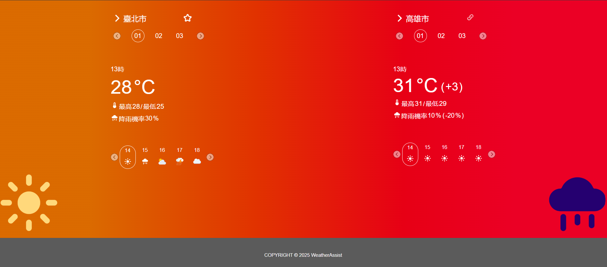

# WeatherAssist _- a Travel Weather Assistant._
**WeatherAssist is a weather search tool designed to help users check the weather conditions at both their departure and destination locations.**
- **Demo Site**: https://z50205.github.io/WeatherAssist/

  </img>

## Features

### Departure/Destination Date & Time Selection
Display weather information using the Instinction interface, integrated with the Central Weather Administration Weather API.
### Responsive Web Design (RWD)
Provide responsive styles optimized for 360px and 768px screen widths.
### Integration with Discord Bot & Email
Via the backend server, enable automated webpage screenshots to be sent to Discord or via email.

## Tech Stack

- **WeatherAssist App:**
  - **Backend:** FastAPI
  - **Frontend:** HTML,CSS,JavaScript
- **Deploy and Environment:**
  - **Proxy Server:** Nginx
  - **AWS Cloud Service:** EC2

## Contributor

- **[tanni6808](https://github.com/tanni6808)(丹妮)**
  - 前端(js使用MVC設計框架撰寫)
    - 氣象局API資料取得
    - 插入氣象資訊
    - 頁面變化等
  - 其他
    - 會議參與、主題討論、成果發表
    - 版面主體設計(Figma)
    - 與組長確認版面是否符合實作需求
    - 與HTML實作者溝通介面互動需求，即時調整設計
- **[yychung-dev](https://github.com/yychung-dev)(雅媛)**
  - 前端(HTML、CSS)
    - html版面設計
    - 樣式設計
    - 動態布局等
  - 其他
    - 會議參與、主題討論、成果發表
    - 360px版面設計(Figma)
    - 與組長確認版面是否符合實作需求
    - 與JavaScript實作者溝通介面互動需求，即時調整設計
- **[ryohei3364](https://github.com/ryohei3364)(芝萍)**
  - 前端
    - Discord BOT轉發API設計
  - 後端
    - Discord BOT轉發API
  - 其他
    - 會議參與、主題構思(旅程與天氣概念)、成果發表
    - 與組長確認實作需求
    - 與前端API溝通介面互動需求，即時調整設計
- **[z50205](https://github.com/z50205)(彬祐)**
  - 前端
    - Email轉發API設計
    - 截圖API設計
    - Favorite站點記憶
    - popup視窗MVC設計
  - 後端
    - Email轉發API
  - 其他
    - 會議參與、主題討論、成果發表
    - 專案架構設計、git工作流管理
    - 域名及https證書更新、Nginx路由設定、EC2部署
    - 與組員確認實作需求

